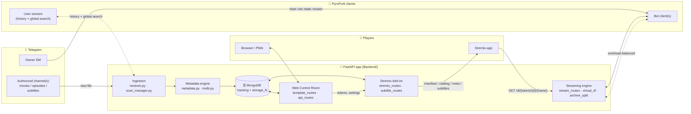

<div align="center">


<br/>

<!-- Badges -->
[](#-changelog--versioning)
[](pyproject.toml)
[](https://fastapi.tiangolo.com/)
[](https://github.com/Mayuri-Chan/pyrofork)
[](#-database-model)
[](https://www.stremio.com/)
[](LICENSE)
[](https://github.com/astral-sh/uv)

**Point a Telegram channel at it once. Get a searchable, posterized, Stremio‑ready media library forever.**

[Features](#-features) •
[How It Works](#-how-it-works) •
[Quick Start](#-quick-start) •
[Deployment](#-deployment) •
[Bot Commands](#-telegram-bot-commands) •
[Web Control Room](#-web-control-room) •
[API Reference](#-rest--admin-api-reference) •
[FAQ](#-troubleshooting--faq)

</div>

<br/>

> [!NOTE]
> This document was written by reading the actual project source — every command, route, environment variable, and default in here is taken directly from the code in this repository (`Backend/`), not assumed. Where the code and the old README disagreed, the **code wins**.

## 📖 What is TG-Stremio?

**TG‑Stremio** turns a private Telegram channel (or several) into a fully featured, self‑hosted streaming backend for **[Stremio](https://www.stremio.com/)**. Forward or post your movies/TV episodes into an authorized Telegram channel, run a scan from the admin panel, and the bot will:

- 🔍 Parse filenames, fetch posters/plots/cast from **TMDB**, and (for anime) cross‑reference **AniList** aliases and absolute‑episode numbering.
- 🗂️ Organize everything into a Movies/TV library with quality variants, multi‑part archives, and split‑video reassembly handled transparently.
- 📡 Serve it all back out as a real **Stremio add‑on** — catalogs, metadata, and direct HTTP streams — playable in Stremio on desktop, mobile, Android TV, or the web.
- 🖥️ Give you a private, password‑protected **web Control Room** to manage the library, subtitles, custom catalogs, access tokens, paid‑subscription gating, and every setting — no `.env` redeploys required.

No Play Store, no third‑party streaming server, no API keys baked into a public bot — it's your channel, your database, your domain.

<br/>

## ✨ Features

### 📡 Streaming Engine
| | |
|---|---|
| 🚀 **Multi-client load balancing** | Streams are distributed across every bot client (and the user session) by current workload, with automatic failure decay so an unhealthy client is skipped instead of stalling a stream. |
| 🧩 **Split-video reassembly** | Large files uploaded to Telegram as multiple parts are stitched into one continuous, seekable stream — byte-range requests are mapped transparently across the underlying parts. |
| 📦 **In-archive ZIP streaming** | Video files inside split or whole `.zip` archives are streamed directly out of the archive (with proper ZIP64 central-directory parsing) — no extraction step, no temp files. |
| ↔️ **HTTP range support** | Full `Range`/`HEAD` support for instant seeking and accurate progress bars in any player. |
| 🛰️ **Global live search fallback** | If a title isn't in your indexed library yet, optionally search a list of *other* Telegram channels live (via your user session) and offer those as fallback streams. |
| 📊 **Per-stream analytics & speed test** | Live active-stream tracking, historical analytics, and an in-panel download speed test per quality. |

### 🤖 Ingestion & Cataloging
| | |
|---|---|
| 📥 **Auto-ingest from authorized channels** | Forward a file into any authorized channel and it's parsed, matched, and added to the library automatically — no manual step. |
| 🔁 **Resumable channel scanner** | Scan or rescan one, several, or all authorized channels for *media*, *subtitles*, or *both* — cursor-based, so it always resumes where it left off. |
| 🎯 **Smart title matching** | `parse-torrent-title` + TMDB + Cinemeta + AniList alias cross-referencing, with fuzzy title scoring and absolute-episode → season/episode mapping for anime. |
| 🩺 **Library health check** | Verifies every stored Telegram message still exists (including every part of a split file) and purges dead entries in one click. |
| 🖼️ **Manual rescan/relink** | Search TMDB directly and re-link a mismatched movie/show from the media editor. |

### 🖥️ Web Control Room (PWA)
| | |
|---|---|
| 🔐 **Session-based admin login** | Password-protected, cookie-session admin panel — no public registration. |
| 🎨 **8 built-in themes** | Dark Professional, Purple Gradient, Navy Blue, Cyber Neon, Midnight Carbon, Ocean Mint, Sunset Warm, Forest Earth. |
| 📚 **Full media management** | Browse, search, edit metadata, delete individual qualities/episodes/seasons, across every storage database. |
| 🗃️ **Custom catalogs** | Build your own hand-picked or auto-synced catalogs (e.g. "My Watchlist", "4K Only") on top of the 22 built-in auto-catalogs. |
| 🔑 **Access & token manager** | Issue per-user streaming tokens with daily/monthly bandwidth caps, link tokens to Telegram user IDs, revoke instantly. |
| 💳 **Subscription gating** | Optional paid-plan system with screenshot-based payment approval and automatic group removal on expiry. |
| 🛠️ **One-page scanner & health-check tools** | The same scan/rescan/dbcheck power once exposed only via bot commands, now in a visual tool with live progress. |
| 📱 **Installable PWA** | Manifest + service worker so the panel installs like a native app on desktop and mobile (online-only by design — see [PWA](#-progressive-web-app)). |

### 🎬 Stremio Add-on
| | |
|---|---|
| 🧩 **Per-user signed add-on links** | Every user gets their own `/stremio/{token}/manifest.json` — no shared credentials. |
| 🌐 **Movies & TV catalogs** | Auto-generated catalogs by language, genre, and curated "smart" lists, plus anything you build manually. |
| 💬 **24-language subtitle delivery** | Indexed subtitle files matched to the right title/episode and served in the Stremio subtitle protocol. |
| ⚙️ **In-Stremio configure page** | A `/configure` page so users can install the add-on with one click from their browser. |

<br/>

## 🧠 How It Works

### Architecture at a glance



### Two requests, end to end

**1. A file lands in your channel → it becomes streamable**

1. You forward/post a video (or it's found during a **Scan**) in an authorized channel.
2. `reciever.py` (live) or `scan_manager.py` (bulk) reads the filename and hands it to the **metadata engine**.
3. `metadata.py` parses the release name (`parse-torrent-title`), builds query variants, and matches it against **TMDB** — with **AniList** alias lookups and absolute-episode mapping for anime — to find the right movie/show/episode.
4. The match (poster, plot, cast, quality, Telegram `chat_id`/`msg_id`, and — for split files — every part) is written into the right `storage_N` database and the relevant auto-catalogs are updated.

**2. Someone presses play in Stremio**

1. Stremio calls your personal add-on URL: `GET /stremio/{token}/stream/{type}/{id}.json`.
2. `stremio_routes.py` validates the token, looks the title up across every storage database, and returns one HTTP stream URL per quality (falling back to **Global Search** across other channels if nothing is indexed yet).
3. Stremio requests `GET /dl/{token}/{id}/{name}` with a `Range` header.
4. `stream_routes.py` decodes the stream id, picks the least-loaded client (bot or user session), and serves the bytes straight from Telegram's CDN — transparently reconstructing the file first if it's a split video or a video packed inside a ZIP.

<br/>

## 🧭 Table of Contents

<details>
<summary><b>Click to expand</b></summary>

- [What is TG-Stremio?](#-what-is-tg-stremio)
- [Features](#-features)
- [How It Works](#-how-it-works)
- [Project Structure](#-project-structure)
- [Requirements](#-requirements)
- [Quick Start](#-quick-start)
- [Environment Variables](#-environment-variables)
- [Deployment](#-deployment)
  - [Hugging Face Spaces](#1-hugging-face-spaces-recommended)
  - [Docker / Docker Compose](#2-docker--docker-compose)
  - [Heroku](#3-heroku)
  - [Bare Metal / VPS](#4-bare-metal--vps-with-uv)
- [Telegram Bot Commands](#-telegram-bot-commands)
- [Web Control Room](#-web-control-room)
- [Stremio Add-on Endpoints](#-stremio-add-on-endpoints)
- [REST / Admin API Reference](#-rest--admin-api-reference)
- [Database Model](#-database-model)
- [Auto-Catalog Library](#-auto-catalog-library)
- [Subtitles](#-subtitles)
- [Access Tokens & Subscriptions](#-access-tokens--subscriptions)
- [Self-Update Mechanism](#-self-update-mechanism)
- [Progressive Web App](#-progressive-web-app)
- [Brand Assets](#-brand-assets)
- [Security Checklist](#-security-checklist)
- [Troubleshooting / FAQ](#-troubleshooting--faq)
- [Changelog & Versioning](#-changelog--versioning)
- [Contributing](#-contributing)
- [License](#-license)
- [Credits & Acknowledgements](#-credits--acknowledgements)
</details>

<br/>

## 🗂️ Project Structure

```text
Stremio-TG/
├── Backend/
│   ├── __main__.py            # Entrypoint — boots bot clients + Uvicorn server together
│   ├── __init__.py            # __version__, shared db handle, start time
│   ├── config.py              # Env var loading (config.env via python-dotenv)
│   ├── logger.py              # Logging setup → log.txt
│   │
│   ├── pyrofork/               # 🤖 Telegram bot layer (PyroFork)
│   │   ├── bot.py             #   StreamBot (one or more bot clients) + workload tracker
│   │   ├── clients.py         #   Userbot session client (history + global search)
│   │   └── plugins/
│   │       ├── start.py             # /start
│   │       ├── utilities.py         # /set, /stats
│   │       ├── manual.py            # bot help / manual text
│   │       ├── restart.py           # /restart (self-update + process re-exec)
│   │       ├── log.py               # /log (sends log.txt)
│   │       ├── reciever.py          # auto-ingest from authorized channels
│   │       ├── subscription.py      # /status + subscription DM/group flow
│   │       └── group_security.py    # kicks unapproved users from gated groups
│   │
│   ├── fastapi/                # 🌐 Web layer
│   │   ├── main.py            #   FastAPI app, middleware, every route registration
│   │   ├── themes.py          #   The 8 built-in Control Room themes
│   │   ├── routes/
│   │   │   ├── template_routes.py     # HTML page handlers (login, dashboard, settings…)
│   │   │   ├── api_routes.py          # Core JSON API (media, tokens, scan, settings…)
│   │   │   ├── stream_routes.py       # /dl/{token}/{id}/{name} — the actual byte streamer
│   │   │   ├── stremio_routes.py      # /stremio/{token}/… manifest · catalog · meta · stream
│   │   │   ├── subtitle_routes.py     # /stremio/{token}/subtitles/… (Stremio protocol)
│   │   │   └── subtitle_api_routes.py # Admin subtitle CRUD for the web panel
│   │   ├── security/
│   │   │   ├── credentials.py # require_auth() session guard + login check
│   │   │   └── tokens.py      # Per-user stream token issuing/validation
│   │   ├── templates/         # 11 Jinja2 templates (see Web Control Room below)
│   │   └── static/
│   │       ├── css/, js/      # Per-page styling & behaviour
│   │       ├── icons/         # PWA icon set (replace with assets/icons/* from this update)
│   │       ├── manifest.webmanifest
│   │       └── service-worker.js
│   │
│   └── helper/                 # 🧰 Business logic
│       ├── database.py            # Multi-database Mongo layer (see Database Model)
│       ├── settings_manager.py    # DB-backed settings — the real source of config truth
│       ├── scan_manager.py        # Channel scanner + library health-check state machines
│       ├── metadata.py            # TMDB/Cinemeta/AniList title matching engine
│       ├── imdb.py                # Cinemeta metadata client
│       ├── auto_catalog.py        # The 22 built-in auto-catalog definitions
│       ├── global_search.py       # Live fallback search across non-indexed channels
│       ├── custom_dl.py           # ByteStreamer — chunked Telegram file reader
│       ├── virtual_dl.py          # Split-video virtual stream reassembly
│       ├── archive_split.py       # In-ZIP (incl. split-ZIP) video streaming
│       ├── split_files.py         # Split-file part bookkeeping helpers
│       ├── subtitle_parser.py / subtitle_service.py / subtitle_models.py / subtitle_constants.py
│       ├── link_checker.py        # Dead-link detection used by the health check
│       ├── subscription_checker.py / subscription_task_manager.py  # Plan-expiry enforcement loop
│       ├── task_manager.py        # Bot client lifecycle + Pyrogram error handling
│       ├── pinger.py              # Keep-alive self-ping loop (for free-tier hosts)
│       ├── public_url.py          # Resolves the externally-reachable base URL
│       ├── encrypt.py             # Compact base62 stream-id encoding
│       ├── modal.py               # Pydantic schemas (quality/part metadata)
│       ├── custom_filter.py       # Pyrogram owner-only filter
│       └── exceptions.py          # InvalidHash, FIleNotFound
│
├── assets/
│   ├── banner.svg / banner.png    # ← added by this update
│   └── icons/                     # ← added by this update (drop into Backend/fastapi/static/icons/)
├── Dockerfile                  # uv-based image, runs start.sh
├── docker-compose.yaml         # Single-service compose file
├── heroku.yml                  # Heroku container-stack build
├── start.sh                    # uv run update.py && uv run -m Backend
├── update.py                   # Self-update: git resets to your configured upstream repo
├── bump-version.py             # Bumps the version in pyproject.toml + Backend/__init__.py together
├── pyproject.toml / uv.lock    # Canonical dependency list (uv)
├── requirements.txt            # Legacy/alternate pip list — see ⚠️ note in Quick Start
├── sample_config.env           # Template for your config.env
└── LICENSE                     # GPL-3.0
```

<br/>

## ✅ Requirements

| Requirement | Why you need it | Where to get it |
|---|---|---|
| **Telegram API ID & Hash** | Lets PyroFork talk to Telegram's MTProto API | [my.telegram.org](https://my.telegram.org) |
| **A Bot Token** | The bot client that serves files | [@BotFather](https://t.me/BotFather) |
| **A User Session String** | Reads full channel history for scanning, and powers Global Search | Generate with a Pyrogram/PyroFork session-string script using the same API ID/Hash |
| **Your numeric Telegram user ID** | Becomes `OWNER_ID` — the only account the bot will obey | [@userinfobot](https://t.me/userinfobot) |
| **MongoDB connection string(s)** | Exactly **2 required**: one tracking DB, one storage DB (add more storage URIs later from Settings) | [MongoDB Atlas](https://www.mongodb.com/atlas) free tier works fine |
| **Python 3.11+** | Runtime | — |
| **[uv](https://github.com/astral-sh/uv)** | Dependency manager + the tool `update.py`/`/restart` shell out to | `pip install uv` or the official installer |
| **A Telegram channel** | Add your bot (and ideally your user account) as admin — this becomes an *authorized channel* | — |

> [!TIP]
> `uv` isn't just for local setup — `/restart` and `start.sh` call the `uv` binary directly at runtime. If you deploy outside Docker (bare metal/VPS), make sure `uv` stays on `PATH` for the running process, not just your shell.

<br/>

## 🚀 Quick Start

```bash
# 1. Clone your fork
git clone https://github.com/tharindu899/Stremio-TG.git
cd Stremio-TG

# 2. Configure secrets
cp sample_config.env config.env
nano config.env        # fill in API_ID, API_HASH, BOT_TOKEN, USER_SESSION_STRING, OWNER_ID, DATABASE, PORT

# 3. Install dependencies with uv (recommended — matches Docker exactly)
uv sync

# 4. Run it
uv run -m Backend
```

> [!WARNING]
> **`requirements.txt` is not a complete dependency list.** It's missing `jinja2`, `itsdangerous`, `python-multipart`, and `requests` — all of which the admin panel needs at runtime (`Jinja2Templates`, `SessionMiddleware`, HTML form parsing). If you don't want to use `uv`, install instead with:
> ```bash
> pip install -e .
> ```
> which reads the **complete** list from `pyproject.toml`.

## 🔑 Environment Variables

`config.env` is read once at boot (via `python-dotenv`). **Almost everything after first boot lives in MongoDB and is edited from Settings, not from this file** — see the callout below.

### Required — `Backend/config.py`

| Variable | Type | Description |
|---|---|---|
| `API_ID` | int | Telegram API ID from my.telegram.org |
| `API_HASH` | str | Telegram API hash |
| `BOT_TOKEN` | str | Bot token from @BotFather |
| `USER_SESSION_STRING` | str | Pyrogram session string for the user account (history scans + global search) |
| `OWNER_ID` | int | Your numeric Telegram user ID — the only account bot commands obey |
| `DATABASE` | str (CSV) | Comma-separated Mongo URIs — **first is the tracking DB, the rest are storage DBs.** Minimum 2. |
| `PORT` | int | Port Uvicorn binds to (default `8000`) |

### First-boot only — seeds the database, then ignored

These exist purely as a migration convenience for the **very first start** (`SettingsManager._seed_from_env()`). Once a settings document exists in Mongo, **editing these in `config.env` again has no effect** — change them from the **Settings** page instead.

| Variable | Default | Becomes the setting |
|---|---|---|
| `REPLACE_MODE` | `true` | `replace_mode` |
| `HIDE_CATALOG` | `false` | `hide_catalog` |
| `AUTH_CHANNEL` | *(empty CSV)* | `auth_channels` |
| `TMDB_API` | *(empty)* | `tmdb_api` |
| `BASE_URL` | *(empty)* | `base_url` — leave empty on most hosts; see [`public_url.py`](#-deployment) |
| `UPSTREAM_REPO` | *(empty)* | `upstream_repo` — your fork, for [self-update](#-self-update-mechanism) |
| `UPSTREAM_BRANCH` | *(empty)* | `upstream_branch` |
| `ADMIN_USERNAME` | `admin` | Control Room login username |
| `ADMIN_PASSWORD` | `admin` | Control Room login password |
| `SUBSCRIPTION` | `false` | `subscription` — enables paid-plan gating |
| `SUBSCRIPTION_GROUP_ID` | `0` | Telegram group used for subscription enforcement |
| `SUBSCRIPTION_URL` | `https://t.me/` | Where unsubscribed users are sent |
| `APPROVER_IDS` | *(empty CSV)* | User IDs allowed to approve payment screenshots |
| `HTTP_Proxy_URL` | *(empty)* | Optional HTTP proxy for one bot client |
| `SHOW_ProxyAndNonProxyBoth` | `false` | Show both proxied/non-proxied stream variants |

> [!IMPORTANT]
> Change `ADMIN_USERNAME`/`ADMIN_PASSWORD` **before the first boot**. Since they only seed the database once, redeploying with new values later (e.g. on Hugging Face Spaces, which rebuilds the container on every push) **will not** change your login — update credentials from the **Settings** page instead.

<br/>

## 📦 Deployment

All four paths below run the **same image** — they just differ in how secrets and the port get to the container.

### 1️⃣ Hugging Face Spaces *(recommended)*

1. Create a new **Space** → SDK: **Docker**.
2. Push this repo's contents to the Space repo (`git remote add space https://huggingface.co/spaces/<you>/<space> && git push space main`).
3. Hugging Face Spaces reads SDK/port config from **YAML front‑matter at the very top of `README.md`**. Add this block above the banner image in this file (or keep the minimal one HF scaffolds for you, just edit `app_port`):
   ```yaml
   ---
   title: TG-Stremio
   emoji: 🎬
   colorFrom: blue
   colorTo: cyan
   sdk: docker
   app_port: 8000
   pinned: false
   ---
   ```
   `app_port: 8000` matches this app's own default (`PORT` defaults to `8000` in `Backend/config.py`), so you don't need to set a `PORT` secret at all.
4. Go to **Settings → Variables and secrets** on the Space and add the [required variables](#-environment-variables) as **secrets**: `API_ID`, `API_HASH`, `BOT_TOKEN`, `USER_SESSION_STRING`, `OWNER_ID`, `DATABASE`. Do **not** rely on a `config.env` file — Spaces injects secrets straight into the container environment, and `config.env` is git‑ignored anyway.
5. Build & wait — first boot takes a few minutes (`uv sync` + `uv lock` run during the image build).

> [!NOTE]
> Free **CPU Basic** Spaces sleep after 48h with zero traffic; any visitor wakes them back up. The built‑in `pinger.py` keep‑alive loop (pings `/api/system/stats` every 20 minutes once `base_url` is set in Settings) is enough to keep a Space that has *any* periodic visitor from ever going fully cold.

### 2️⃣ Docker / Docker Compose

```bash
cp sample_config.env config.env && nano config.env   # docker-compose.yaml volume-mounts this file directly
docker compose up -d --build
```

Or with plain Docker (env vars injected instead of a mounted file):

```bash
docker build -t tg-stremio .
docker run -d --name tg_stremio -p 8000:8000 --env-file config.env --restart unless-stopped tg-stremio
```

### 3️⃣ Heroku

`heroku.yml` builds straight from the `Dockerfile` (container stack):

```bash
heroku create your-app-name
heroku stack:set container -a your-app-name
heroku config:set API_ID=... API_HASH=... BOT_TOKEN=... USER_SESSION_STRING=... OWNER_ID=... DATABASE=... -a your-app-name
git push heroku main
```

Heroku assigns its own `$PORT` automatically — `Backend/config.py` already reads `PORT` from the environment, so no extra step is needed there.

### 4️⃣ Bare Metal / VPS (with `uv`)

```bash
git clone https://github.com/tharindu899/Stremio-TG.git && cd Stremio-TG
cp sample_config.env config.env && nano config.env
uv sync
uv run -m Backend
```

For a real always‑on deployment, run it under a process supervisor rather than a bare foreground process, e.g. `systemd`:

```ini
# /etc/systemd/system/tg-stremio.service
[Unit]
Description=TG-Stremio
After=network.target

[Service]
WorkingDirectory=/opt/Stremio-TG
ExecStart=/usr/bin/env bash start.sh
Restart=on-failure
User=youruser

[Install]
WantedBy=multi-user.target
```

```bash
sudo systemctl enable --now tg-stremio
```

> [!TIP]
> Doing development from **Termux on Android**? The exact same `uv sync && uv run -m Backend` commands work there too — it's a great way to test config or watch logs live, just don't rely on a phone for 24/7 hosting.

<br/>

## 🤖 Telegram Bot Commands

All commands are **private‑chat, owner‑only** (`OWNER_ID`) unless noted — the bot will not respond to anyone else.

| Command | Source | Description |
|---|---|---|
| `/start` | `plugins/start.py` | Health‑check / welcome message. |
| `/set` | `plugins/utilities.py` | Opens the settings shortcut menu from chat. |
| `/stats` | `plugins/utilities.py` | Bot/server resource stats (uptime, CPU, RAM, disk). |
| `/status` | `plugins/subscription.py` | Checks your own subscription/access status (used with subscription gating enabled). |
| `/log` | `plugins/log.py` | Sends `log.txt` as a document. |
| `/restart` | `plugins/restart.py` | Runs `uv run update.py` (self‑update) then re‑execs the process in place with `uv run -m Backend` — no container restart needed. |

> [!NOTE]
> Earlier versions of this project exposed `/scan`, `/rescan`, and `/dbcheck` as bot commands. **They've since moved entirely into the web Control Room** (`Admin → Scanner Tools`) — `main.py` even labels that route block *"WebUI replacement for /scan, /rescan, /dbcheck bot commands."* Don't look for them in chat anymore.

Beyond commands, the bot also runs silently in the background:
- **`reciever.py`** — auto-ingests any new file posted to an authorized channel.
- **`group_security.py`** — removes unapproved/expired users from a subscription-gated group.
- **`subscription_checker.py`** — a loop enforcing plan expiry when `subscription` is enabled.

<br/>

## 🖥️ Web Control Room

Every page below lives behind the cookie‑session login (`require_auth`) except **Login**, **Public Status**, and the **Stremio guide**.

| Page | Route | Purpose |
|---|---|---|
| 🔑 Login | `GET/POST /login` | Username/password form (`ADMIN_USERNAME`/`ADMIN_PASSWORD`, see [Settings](#-environment-variables)). |
| 📈 Overview | `GET /` | Landing dashboard — at-a-glance stats. |
| 📊 Operations | `GET /admin/dashboard` | System stats, dead-link list, stream analytics, cache clearing. |
| 🎞️ Media Library | `GET /media/manage` | Browse/search/delete movies & TV across every storage database. |
| ✏️ Media Editor | `GET /media/edit` | Edit one title's metadata, qualities, episodes; trigger a TMDB re‑match. |
| 💬 Subtitles | `GET /subtitles` | Search, edit, relink, or delete indexed subtitle files. |
| 🗃️ Catalogs | `GET /catalogs` | Build/manage custom catalogs on top of the 22 auto‑catalogs. |
| 🛠️ Scanner Tools | `GET /admin/tools` | Channel scanner + library health check, with live progress bars. |
| 🔐 Access | `GET /admin/access` | Issue/revoke per‑user streaming tokens, set bandwidth limits, link a token to a Telegram ID. |
| 💳 Subscriptions | `GET /admin/subscriptions` | Manage plans, approve/reject payment screenshots, view subscribers. |
| ⚙️ Settings | `GET /admin/settings` | Every DB‑backed setting — channels, TMDB key, themes, upstream repo, global search, proxy, and more. |
| 🌐 Public Status | `GET /status` | Unauthenticated status page — safe to share publicly. |
| 📖 Stremio Guide | `GET /stremio` | Unauthenticated install instructions for end users. |

All 8 themes (Dark Professional · Purple Gradient · Navy Blue · Cyber Neon · Midnight Carbon · Ocean Mint · Sunset Warm · Forest Earth) are switchable instantly from any page via `POST /set-theme` — no reload‑the‑server step.

<br/>

## 🎬 Stremio Add-on Endpoints

Every add‑on URL is namespaced under a per‑user `{token}` (issued from **Access**), so nothing is shared between users.

| Method | Endpoint | Purpose |
|---|---|---|
| `GET` | `/stremio/{token}/manifest.json` | The add-on manifest Stremio reads to install it. |
| `GET` | `/stremio/{token}/configure` | Browser-friendly install page — what you actually send people. |
| `GET` | `/stremio/{token}/catalog/{type}/{id}.json` | Catalog listing (movie/series), optionally with `/{extra}` for search/genre/skip paging. |
| `GET` | `/stremio/{token}/meta/{type}/{id}.json` | Full metadata for one title (poster, plot, cast, episodes). |
| `GET` | `/stremio/{token}/stream/{type}/{id}.json` | The actual list of playable streams for a title — falls back to **Global Search** if nothing is indexed. |
| `GET` | `/stremio/{token}/subtitles/{type}/{id}.json` | Subtitle tracks for a title (`/subtitle/...` singular alias also accepted). |
| `GET`/`HEAD` | `/dl/{token}/{id}/{name}` | The byte-range file streamer every `stream` entry points at. |
| `GET` | `/stream/stats` / `/stream/stats/{stream_id}` | Live active-stream telemetry. |

**Installing in Stremio:** open `https://your-domain/stremio/{token}/configure` in a browser, or paste `https://your-domain/stremio/{token}/manifest.json` directly into Stremio's *"Add‑on Repository URL"* field.

<br/>

## 🛰️ REST / Admin API Reference

Every route below requires the admin session cookie (`require_auth`) and lives in `Backend/fastapi/routes/api_routes.py` + `subtitle_api_routes.py`, wired up in `main.py`. Grouped by area:

<details>
<summary><b>📚 Media library</b></summary>

| Method | Endpoint |
|---|---|
| `GET` | `/api/media/list` |
| `DELETE` | `/api/media/delete` |
| `PUT` | `/api/media/update` |
| `DELETE` | `/api/media/delete-quality` |
| `DELETE` | `/api/media/delete-tv-quality` |
| `DELETE` | `/api/media/delete-tv-episode` |
| `DELETE` | `/api/media/delete-tv-season` |
| `GET` | `/api/media/rescan/search` |
| `POST` | `/api/media/rescan/apply` |

</details>

<details>
<summary><b>💬 Subtitles</b></summary>

| Method | Endpoint |
|---|---|
| `GET` | `/api/subtitles` |
| `GET` | `/api/subtitles/stats` |
| `PUT` | `/api/subtitles/{subtitle_id}` |
| `POST` | `/api/subtitles/relink` |
| `DELETE` | `/api/subtitles/{subtitle_id}` |

</details>

<details>
<summary><b>🗃️ Custom catalogs</b></summary>

| Method | Endpoint |
|---|---|
| `GET`/`POST` | `/api/custom-catalogs` |
| `PUT`/`DELETE` | `/api/custom-catalogs/{catalog_id}` |
| `GET` | `/api/custom-catalogs/search-media` |
| `GET`/`POST`/`DELETE` | `/api/custom-catalogs/{catalog_id}/items` |
| `POST` | `/api/custom-catalogs/auto-sync` |
| `GET` | `/api/custom-catalogs/auto-sync/status` |
| `GET`/`PUT` | `/api/custom-catalogs/auto-sync/settings` |

</details>

<details>
<summary><b>🔑 Access tokens</b></summary>

| Method | Endpoint |
|---|---|
| `POST` | `/api/tokens` |
| `PUT` | `/api/tokens/{token}` |
| `DELETE` | `/api/tokens/{token}` |
| `GET` | `/api/admin/access/tokens` |
| `DELETE` | `/api/admin/access/tokens/{token}` |
| `POST` | `/api/admin/access/users/{user_id}/assign-plan` |
| `PATCH` | `/api/admin/access/tokens/{token}/link-user` |

</details>

<details>
<summary><b>💳 Subscriptions</b></summary>

| Method | Endpoint |
|---|---|
| `GET`/`POST` | `/api/admin/subscriptions/plans` |
| `PUT`/`DELETE` | `/api/admin/subscriptions/plans/{plan_id}` |
| `GET` | `/api/admin/subscriptions/users` |
| `POST` | `/api/admin/subscriptions/users/{user_id}/manage` |

</details>

<details>
<summary><b>🛠️ Scanner & health-check tools</b></summary>

| Method | Endpoint |
|---|---|
| `GET` | `/api/admin/tools/channels` |
| `POST` | `/api/admin/tools/scan/start` |
| `POST` | `/api/admin/tools/scan/cancel` |
| `GET` | `/api/admin/tools/scan/status` |
| `POST` | `/api/admin/tools/dbcheck/start` |
| `POST` | `/api/admin/tools/dbcheck/cancel` |
| `GET` | `/api/admin/tools/dbcheck/status` |
| `POST` | `/api/admin/tools/dead-links/purge` |

</details>

<details>
<summary><b>⚙️ System, settings & diagnostics</b></summary>

| Method | Endpoint |
|---|---|
| `GET` | `/api/system/stats` |
| `GET` | `/api/system/workloads` |
| `GET` | `/api/system/speedtest` / `/api/system/speedtest/stream` |
| `GET` | `/api/admin/system-stats` |
| `POST` | `/api/admin/clear-cache` |
| `GET` | `/api/admin/dead-links` |
| `GET` | `/api/admin/stream-analytics` |
| `POST` | `/api/admin/clear-analytics` |
| `GET`/`PUT` | `/api/admin/settings` |

</details>

<br/>

## 🗄️ Database Model

`DATABASE` is a comma-separated list of MongoDB URIs. The **first** is the **tracking** database; **every URI after it is a storage shard**:

```text
DATABASE = "mongodb+srv://tracking-uri/...,mongodb+srv://storage-1-uri/...,mongodb+srv://storage-2-uri/..."
```

| Database | Holds | Notes |
|---|---|---|
| **`tracking`** (URI #1) | Settings, users, access tokens, custom catalogs, scan/dbcheck state, stream analytics, subscription plans | One copy, never sharded |
| **`storage_1`, `storage_2`, …** (URI #2+) | Movies & TV documents (poster, metadata, qualities, parts) | `database.py` automatically rotates to the **next** storage URI once one fills up, and reads across **all** of them when listing/searching — so you scale capacity by adding another free-tier Mongo URI from **Settings**, no migration needed |

Why multiple storage databases? Free-tier MongoDB (e.g. Atlas's M0) caps you at ~512MB — far too small for a large library's metadata. Rather than asking you to manage that manually, the app treats every storage URI as one pool, automatically failing over to the next when the current one reports it's full.

<br/>

## 📺 Auto-Catalog Library

Beyond anything you build by hand in **Catalogs**, the app ships **22 ready-made catalogs** (`auto_catalog.py`) that you toggle on/off and that re-sync on their own every hour once at least one is enabled:

<table>
<tr><th>🌍 Language (12)</th><th>🧠 Smart (2)</th><th>🎟️ OTT Platform (8)</th></tr>
<tr valign="top">
<td>

Bollywood · Hollywood · Anime · K‑Drama · Bengali · South Indian · Tamil · Telugu · Malayalam · Kannada · Japanese · Korean

</td>
<td>

Top Rated · Recently Added

</td>
<td>

Netflix · Prime Video · Hotstar · Apple TV · Hulu · HBO · JioCinema · ZEE5 · SonyLIV · MX Player · Crunchyroll

</td>
</tr>
</table>

- **Language** catalogs match each title's detected audio/title language.
- **Smart** catalogs are derived from your own library's rating and add-date.
- **OTT** catalogs are populated from TMDB's watch‑provider data (region defaults to `IN`) — a title shows up under Netflix, Prime Video, etc. the same way TMDB knows it streams there.
- A valid **TMDB API key** (set once in `config.env` as `TMDB_API`, or anytime from **Settings → Metadata**) is required for matching, OTT-provider lookups, and posters.

<br/>

## 💬 Subtitles

Subtitles are scanned, parsed, and linked to the **exact** movie or episode they belong to, then served through Stremio's native subtitle protocol (`/stremio/{token}/subtitles/...`) — no separate subtitle add-on needed.

**Formats:** `.srt` `.vtt` `.ass` `.ssa` `.sub` `.smi` `.sami`

**24 recognized languages** (`subtitle_constants.py`):

| | | | |
|---|---|---|---|
| Arabic | Bengali | German | English |
| Spanish | Persian | French | Hindi |
| Indonesian | Italian | Japanese | Korean |
| Kannada | Malayalam | Malay | Portuguese |
| Russian | **Sinhala** | Tamil | Telugu |
| Turkish | Urdu | Chinese | *Unknown (fallback)* |

From the **Subtitles** page you can filter by matched/unmatched status or language, manually relink a subtitle to the correct title, or bulk **relink** everything after a metadata fix.

<br/>

## 🔐 Access Tokens & Subscriptions

Two independent (combinable) ways to control who can stream:

### Access tokens
- Issued per user from **Admin → Access** (`POST /api/tokens`).
- Each token can carry a **daily** and/or **monthly bandwidth cap in GB** — usage is tracked live, byte‑by‑byte, while a stream is active (`helper/utils.py:track_usage`, updated every ~10s).
- A token can be **linked to a specific Telegram user ID**, so the bot can issue/look up "your" link, then revoked instantly without affecting anyone else.

### Subscriptions (optional, `subscription` setting)
- Define one or more **plans** (price, duration) from **Admin → Subscriptions**.
- Users send a payment screenshot; an approver (`APPROVER_IDS`) approves or rejects it from chat.
- A background loop (`subscription_checker.py`) continuously checks expiry, and `group_security.py` automatically removes anyone whose plan has lapsed from your gated Telegram group.
- `/status` lets a user check their own remaining time from chat.

<br/>

## 🔁 Self-Update Mechanism

This project can update **itself from your own fork** on every restart — no manual `git pull`, no redeploy click.

How it works (`update.py`, `start.sh`, `plugins/restart.py`):

1. `start.sh` always runs `uv run update.py` *before* starting the app.
2. `update.py` looks up `upstream_repo` / `upstream_branch` from **Settings** first (falling back to the `UPSTREAM_REPO`/`UPSTREAM_BRANCH` first-boot env vars).
3. If an upstream repo is configured, it **wipes any local `.git`, re-initializes, fetches that repo, and hard-resets the entire working directory to `origin/{branch}`.**
4. The bot's `/restart` command does the same update step, then re-executes the running process in place (`os.execl`) — so triggering an update is as simple as DM‑ing your own bot `/restart`.

> [!CAUTION]
> Step 3 is a **hard reset**, not a merge. If `upstream_repo` is set, every restart overwrites local files with whatever is on that branch. Don't hand‑edit files on a live deployment that has self‑update enabled unless you've pushed those same changes upstream first — they will be wiped on the next `/restart` or container restart.

Leave `upstream_repo` empty (the default) to disable this entirely and manage updates yourself.

<br/>

## 📱 Progressive Web App

The Control Room is installable like a native app on desktop and mobile (`manifest.webmanifest` + `service-worker.js`), but it's **intentionally online‑only**:

- No page, API response, or media file is ever cached.
- The service worker exists purely so the manifest is valid and the install prompt appears — not for offline use.
- This is deliberate: the panel always shows live data and never serves a stale dashboard from cache.

To install: open the site in Chrome/Edge/Safari → *"Install app"* / *"Add to Home Screen"*.

<br/>

## 🎨 Brand Assets

This update adds a matching banner + PWA icon set, generated as vector source so they stay crisp at any size — no existing code changes required, they're drop‑in replacements.

<table>
<tr>
<td align="center" width="33%"><br/><sub><code>icon-512.png</code></sub></td>
<td align="center" width="33%"><br/><sub><code>apple-touch-icon.png</code></sub></td>
<td align="center" width="33%"><br/><sub><code>icon-192.png</code></sub></td>
</tr>
</table>

| File | Drop it into | Notes |
|---|---|---|
| `assets/banner.svg` + `assets/banner.png` | `assets/` (repo root) | Used at the top of this README. SVG for editing, PNG for guaranteed‑identical rendering everywhere (the SVG uses system fonts, so a viewer without them could see a different typeface — the PNG always looks right). |
| `assets/icons/icon-512.png` | `Backend/fastapi/static/icons/icon-512.png` | Maskable PWA icon (512×512) |
| `assets/icons/icon-192.png` | `Backend/fastapi/static/icons/icon-192.png` | Maskable PWA icon (192×192) |
| `assets/icons/apple-touch-icon.png` | `Backend/fastapi/static/icons/apple-touch-icon.png` | iOS home‑screen icon (180×180) |
| `assets/icons/favicon.ico` | `Backend/fastapi/static/icons/favicon.ico` | Browser tab icon (16/32/48 multi‑res) |
| `assets/icons/icon-source.svg` | *(keep anywhere for future edits)* | Editable source — full‑bleed, with all artwork kept inside the safe zone so Android/iOS adaptive‑icon masks never clip it |

All four PWA files use the **exact filenames `base.html` and `manifest.webmanifest` already reference** — just overwrite what's in `Backend/fastapi/static/icons/` and you're done, no template or manifest edits needed.

<br/>

## 🛡️ Security Checklist

A few things worth doing before you expose this publicly, found while reading the actual source:

- [ ] **Change the session secret key.** `Backend/fastapi/main.py` currently hardcodes `SessionMiddleware`'s `secret_key` as a literal string in source. Since this is open-source code, that exact value is visible to anyone who reads the repository — generate your own random 64‑char secret and replace it (or better, load it from an env var) before deploying publicly.
- [ ] **Change `ADMIN_USERNAME`/`ADMIN_PASSWORD` before first boot** (they default to `admin`/`admin` and only seed once — see [Environment Variables](#-environment-variables)).
- [ ] **Never commit `config.env`** — it's already in `.gitignore`; keep it that way.
- [ ] **Treat Stremio add‑on links (`/stremio/{token}/...`) like passwords.** Anyone with the URL can browse and stream your library. Issue separate tokens per person from **Access** and revoke one if it leaks, instead of sharing one link with everyone.
- [ ] **Double‑check `OWNER_ID`.** Every bot command is gated on this single Telegram user ID — there's no multi‑admin bot access by design.
- [ ] **Treat `upstream_repo` as a trust boundary.** Whoever controls that branch can push code that gets hard‑reset into your live deployment on every restart (see [Self-Update](#-self-update-mechanism)) — only point it at a repo you control.

<br/>

## ❓ Troubleshooting / FAQ

<details>
<summary><b>I changed a value in <code>config.env</code> and nothing happened.</b></summary>
<br/>

Almost everything except the 7 truly required variables (`API_ID`, `API_HASH`, `BOT_TOKEN`, `USER_SESSION_STRING`, `OWNER_ID`, `DATABASE`, `PORT`) is only read from `config.env` **once**, on the very first boot, to seed the database. After that, the database is the source of truth — make the change from the **Settings** page instead. See [Environment Variables](#-environment-variables).
</details>

<details>
<summary><b>My local file edits disappeared after a restart.</b></summary>
<br/>

You (or a previous session) have `upstream_repo` set in Settings. Every restart hard‑resets the working directory to that repo/branch. See [Self-Update Mechanism](#-self-update-mechanism) — clear `upstream_repo` if you want to manage code manually.
</details>

<details>
<summary><b>"Global Search" won't turn on / says rejected.</b></summary>
<br/>

It requires a working `USER_SESSION_STRING` (a real user account session, not just the bot). `SettingsManager` rejects enabling it without one — generate a session string and set it in `config.env` before first boot (or restart after adding it).
</details>

<details>
<summary><b>How do I add more storage capacity without losing data?</b></summary>
<br/>

Add another MongoDB URI from **Settings** (the `extra_databases` field) instead of editing `DATABASE` directly post‑launch — the app will start filling the new one once existing storage databases report full, and continues reading across all of them.
</details>

<details>
<summary><b>Subtitles aren't matching to the right episode.</b></summary>
<br/>

Run a **Scan** with scope set to *Subtitles* (or *All*) from **Admin → Scanner Tools** after the matching video is already indexed, then use **Subtitles → Relink** if a specific file still shows as unmatched.
</details>

<details>
<summary><b><code>/restart</code> fails with "uv not found in PATH".</b></summary>
<br/>

`/restart` shells out to the literal `uv` binary. Make sure whatever runs `Backend/__main__.py` (your Dockerfile, systemd unit, or shell) has `uv` on `PATH` for that process — not just your interactive login shell.
</details>

<details>
<summary><b>Deployed to Hugging Face Spaces and the page won't load.</b></summary>
<br/>

Check that `app_port` in your Space's README YAML front‑matter matches what the app is actually listening on (`8000` by default, unless you've set a `PORT` secret). See [Hugging Face Spaces](#1-hugging-face-spaces-recommended).
</details>

> [!NOTE]
> Discussing video streaming, copyright, and content moderation: this project streams whatever you index from channels **you** control — keep your usage compliant with Telegram's Terms of Service and your local laws around the content you store and redistribute.

<br/>

## 🏷️ Changelog & Versioning

The version number is tracked in **two** places and kept in sync by `bump-version.py`:

```bash
python bump-version.py patch   # 3.6.15 → 3.6.16
python bump-version.py minor   # 3.6.15 → 3.7.0
python bump-version.py major   # 3.6.15 → 4.0.0
```

This rewrites `version = "..."` in `pyproject.toml` and `__version__ = "..."` in `Backend/__init__.py` together — the value shown in this README's top badge and in the FastAPI `/docs` page comes from the **latter**.

> [!NOTE]
> At the time of writing, this repository's `pyproject.toml` (`3.5.3`) and `Backend/__init__.py` (`3.6.15`) have drifted out of sync — likely from a manual edit to one file without re-running `bump-version.py`. Worth running the script once (or hand-editing `pyproject.toml`) to realign them.
>
> There's no `CHANGELOG.md` in this repository — version history lives in the project's commit log.

<br/>

## 🤝 Contributing

1. Fork → branch (`feat/your-thing` or `fix/your-thing`) → commit with clear messages.
2. Keep diffs focused — one feature/fix per PR is much easier to review than a mixed bag.
3. If you touch `Backend/helper/database.py`, `scan_manager.py`, or anything else core, please test against a real (or disposable) MongoDB instance before opening the PR — there's currently no automated test suite in this repository.
4. Open a PR describing **what** changed and **why**.

There's no `CONTRIBUTING.md` template in this repo yet — the steps above are the de‑facto process until one exists.

<br/>

## 📜 License

Licensed under the **[GNU General Public License v3.0](LICENSE)**.

In short (not legal advice — read the [full text](LICENSE) for the actual terms): you're free to use, modify, and redistribute this project, including commercially, but any distributed derivative work must also be licensed under GPL‑3.0 with source made available, and must preserve the original copyright/license notices.

<br/>

## 🙏 Credits & Acknowledgements

- **[PyroFork](https://github.com/Mayuri-Chan/pyrofork)** — the Pyrogram fork powering every Telegram interaction.
- **[FastAPI](https://fastapi.tiangolo.com/)** & **[Uvicorn](https://www.uvicorn.org/)** — the web framework and ASGI server.
- **[MongoDB](https://www.mongodb.com/)** (via **[Motor](https://motor.readthedocs.io/)**) — the database layer.
- **[TMDB](https://www.themoviedb.org/)** and **[Stremio's Cinemeta](https://github.com/Stremio/stremio-addons)** — metadata and posters. *This product uses the TMDB API but is not endorsed or certified by TMDB.*
- **[AniList](https://anilist.co/)** — anime title aliasing and absolute‑episode mapping.
- **[Stremio](https://www.stremio.com/)** — the add‑on protocol this project implements.
- **[uv](https://github.com/astral-sh/uv)** by Astral — dependency management and the runtime used by `start.sh`/`update.py`/`/restart`.
- **[Font Awesome](https://fontawesome.com/)** — icons throughout the Control Room UI.
- The wider Telegram‑streaming‑bot open‑source community this project's update mechanism and groundwork trace back to — credit to the original authors whose patterns (visible in `update.py`'s embedded git identity) this codebase builds on.

<br/>

<div align="center">


**Built for self-hosters who'd rather own their stack than rent someone else's.**

[⬆ Back to top](#-table-of-contents)

</div>
